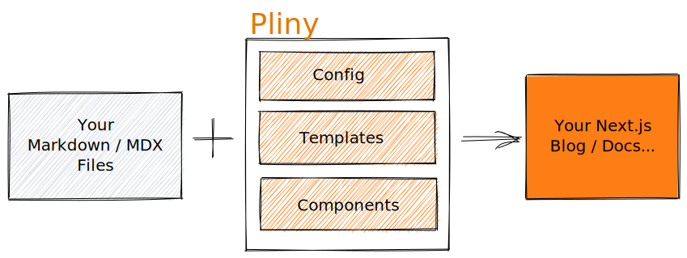

# Pliny

**Note: Pliny is currently in alpha. Expect breaking changes.**

Pliny makes creating, editing and publishing markdown content easy and simple. It is based on [Next.js][nextjs], [Tailwind CSS][tailwindcss] and [Contentlayer][contentlayer].



## Installation

```bash
npm i -g @pliny/cli
```

## Usage

Here are some examples of common commands:

### Create a new starter blog project called "my-blog"

```bash
pliny new --template=starter-blog my-blog
```

### Add a recipe

Currently, there are 2 main types of recipes - scaffolding a content type e.g. the pages associated with a blog or adding templates to the `layouts` folder. As a convention, recipes to scaffold are in the form of `add-[content type]` while layouts are in the form of `[content type]-[theme]`.

Adding a blog page to an existing Next.js application (assumes you have contentlayer setup, as it will automatically add `defineDocumentType`)

```bash
pliny install add-blog ContentDir=data ContentName=Blog
```

Add the blog-classic templates to the `layouts` folder:

```bash
pliny install blog-classic
```

## Features

1. Best in class developer experience for building a markdown website, courtesy of [contentlayer], including:

- Live reload on content changes
- Fast and incremental builds
- Simple but powerful schema DSL to design your content model (validates your content and generates types)
- Auto-generated TypeScript types based on your content model (e.g. frontmatter or CMS schema)

2. Out of the box templates based on [Next.js][nextjs] and [Tailwindcss][tailwindcss]

3. Full suite of markdown plugins including:

- Server-side syntax highlighting with line numbers and line highlighting via [rehype-prism-plus]
- Math display supported via [KaTeX][katex]
- Citation and bibliography support via [rehype-citation]

4. React components for common services

- Newsletter (Buttondown, Convertkit, Email Octopus, Klaviyo, Mailchimp, Revue)
- Analytics (Google Analytics, Plausible Analytics, Simple Analytics, Umami Analytics)
- Comment system (Disqus, Giscus, Utterances)

[nextjs]: https://nextjs.org/
[tailwindcss]: https://tailwindcss.com/
[contentlayer]: https://github.com/contentlayerdev/contentlayer
[rehype-prism-plus]: https://github.com/timlrx/rehype-prism-plus
[katex]: https://katex.org/
[rehype-citation]: https://github.com/timlrx/rehype-citation
